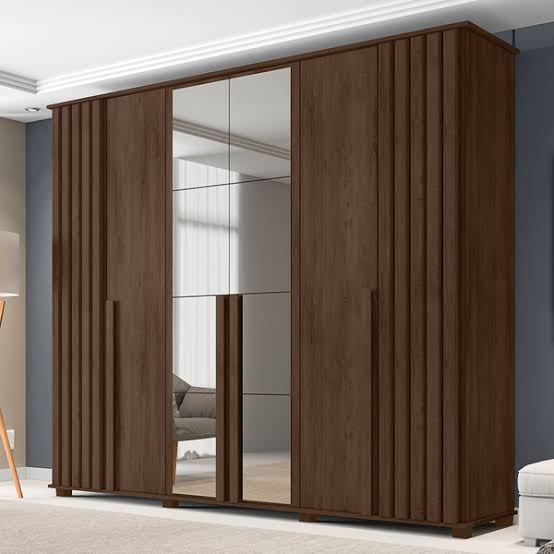
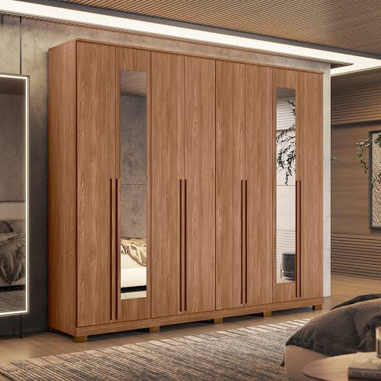

# 🏠 Casa Montada

<p align="center">
  
</p>

<p align="center">
  Serviços profissionais de montagem e desmontagem de móveis no Rio de Janeiro
</p>

<p align="center">
  
  
  
  
  
</p>

<p align="center">
  <a href="#-projeto">Projeto</a>&nbsp;&nbsp;&nbsp;|&nbsp;&nbsp;&nbsp;
  <a href="#-tecnologias">Tecnologias</a>&nbsp;&nbsp;&nbsp;|&nbsp;&nbsp;&nbsp;
  <a href="#-features">Features</a>&nbsp;&nbsp;&nbsp;|&nbsp;&nbsp;&nbsp;
  <a href="#-layout">Layout</a>&nbsp;&nbsp;&nbsp;|&nbsp;&nbsp;&nbsp;
  <a href="#-como-executar">Como Executar</a>&nbsp;&nbsp;&nbsp;|&nbsp;&nbsp;&nbsp;
  <a href="#-licença">Licença</a>
</p>

<br>

## 📋 Projeto

O Casa Montada é uma plataforma web profissional para serviços de montagem e desmontagem de móveis no Rio de Janeiro. Desenvolvida com tecnologias modernas para garantir performance, segurança e excelente experiência do usuário.

### 🎯 Objetivos

- Facilitar o agendamento de serviços de montagem
- Oferecer transparência no processo
- Garantir qualidade e profissionalismo
- Proporcionar uma experiência digital excepcional

## 🚀 Tecnologias

Este projeto foi desenvolvido com as seguintes tecnologias:

- ⚛️ **React** - Biblioteca JavaScript para criação de interfaces
- 📘 **TypeScript** - Superset JavaScript com tipagem estática
- ⚡ **Vite** - Build tool e bundler ultrarrápido
- 🎨 **Tailwind CSS** - Framework CSS utility-first
- 📱 **Responsive Design** - Layout adaptável para todos os dispositivos
- 🔍 **SEO Otimizado** - Melhores práticas para motores de busca
- 🛡️ **Segurança** - Headers e políticas de segurança configurados
- 🚀 **Performance** - Otimizações para carregamento rápido
- 📊 **Analytics** - Rastreamento e análise de dados
- 🌐 **Vercel** - Plataforma de deploy e hospedagem

## 💡 Features

- ✨ Interface moderna e intuitiva
- 📱 Design responsivo
- 🔍 SEO otimizado
- 🛡️ Segurança reforçada
- 🚀 Performance otimizada
- 📊 Analytics integrado
- 🌐 Deploy automatizado

## 🎨 Layout

<p align="center">
  
  
</p>

## 🚀 Como Executar

```bash
# Clone este repositório
$ git clone https://github.com/FuturoDevJunior/casamontada.git

# Acesse a pasta do projeto
$ cd casamontada

# Instale as dependências
$ npm install

# Execute a aplicação em modo de desenvolvimento
$ npm run dev

# O servidor inciará na porta:5173 - acesse http://localhost:5173
```

## 📝 Licença

Este projeto está sob a licença MIT. Veja o arquivo [LICENSE](LICENSE) para mais detalhes.

---

<p align="center">
  Feito com 💜 por Gabriel Ferreira
</p> 